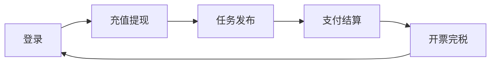

# 引导

## 系统简介

灵时云以“数字驱动”为战略导向，致力为服务于互联网平台的自由职业者提供数智化财务管理、税务管理技术解决方案，协助平台型企业在业务发展过程中快速实现税务数智化合规建设。

## 主要功能

主要具有首页、任务管理、创客管理、结算管理、我的账户、财务管理、票税管理、风控管理、API对接等功能，能够为商户提供更加便捷，全面的服务

## 基本业务流程

基本业务流程，如下图：

详细可参考[操作指南](/instruction/login/)

### 登录

打开官网[http://s.linsyun.com](http://s.linsyun.com)根据运营人员创建的商户账号进行登录，输入账号和密码登录系统。

商户端首页，查看该商户的账户余额、可用余额、结算中金额等信息。快捷导航迅速跳转到需要进入的功能页面。消息通知是围绕系统与用户进行沟通交流的重要方式，目的在于让用户了解新事件的信息动态，今日代办会展示今日需办理的业务事项。创客签约码用于提供给用户去认证签约。

### 充值提现

商户端-我的账户中：可进行充值金额到账户，充值到账可查看余额；可将余额提现至银行卡或支付宝。您可至财务中心查看支出流水及提现充值记录。

### 任务发布

商户登陆后，点击侧边导航栏-任务管理-任务列表，查看已发布的所有任务；点击【发布任务】按钮发布新任务。

### 支付结算

点击侧边导航栏-结算管理-结算单，查看已上传的所有结算单，在导入结算单之前您需先在创客列表导入对应的创客信息。导入结算单后审核通过即可进行确认发放。

### C端认证

您可将首页的【创客签约码】发送给创客，让创客手机扫码进入到小程序进行认证签约。

### 开票完税

点击侧边导航栏-票税管理-发票申请，当前页面显示已发放完成的所有结算单，勾选可开票结算单后，点击【申请开票】按钮，进入申请开票流程，开票前您需先新增好发票抬头信息和地址。

## 关于我们

若您有任何疑问，随时咨询我们！！！  

微信公众号：

客服邮箱：vip@linsyun.com

联系电话：19538768503

服务时间：周一至周五 9:00-18:00
