# 税票管理

## 1. 发票申请

点击侧边导航栏-票税管理-发票申请，当前页面显示已发放完成的所有结算单，可以输入结算单号，选择发放日期进行发票的筛选如下图：

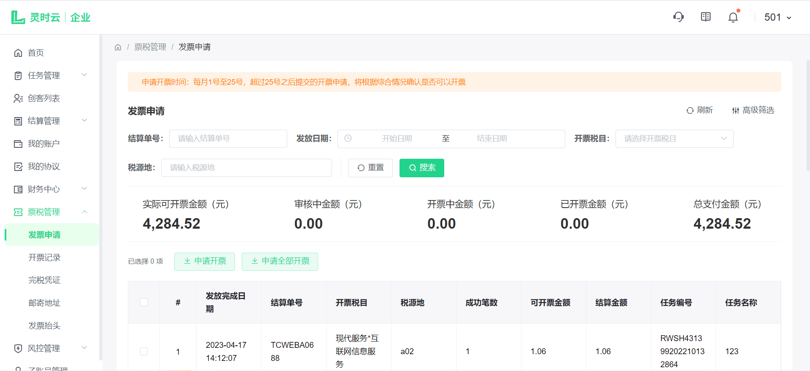

勾选可开票结算单后，点击【申请开票】按钮，进入申请开票流程，如下图所示：

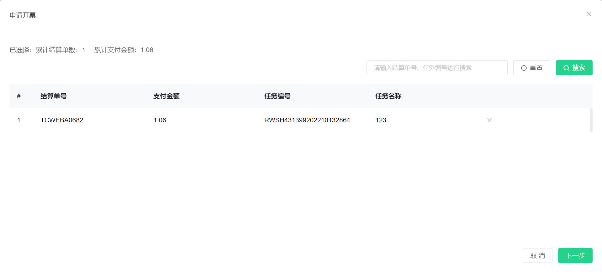

<<<<<<< Updated upstream
点击下一步，如下图：
=======
您需选择/填写发票类型、发票抬头、邮寄地址、邮箱、备注等基本信息。（若您选择的发票类型是电子发票，邮寄地址选填，邮箱信息必填）

发票抬头、收件人信息模块，点击文本框，可更换对应的信息（若没有信息可点击【新增发票抬头/邮寄地址】填写），如下图所示：
>>>>>>> Stashed changes

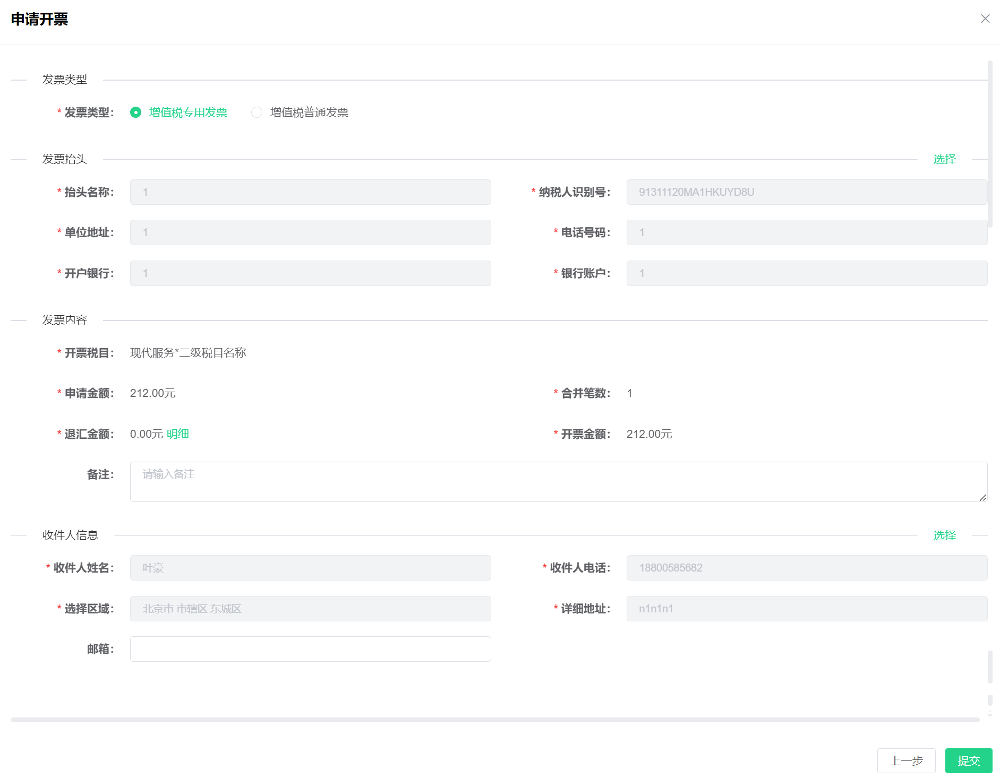

发票抬头、收件人信息模块，点击【选择】按钮，可更换对应的信息，如下图所示：

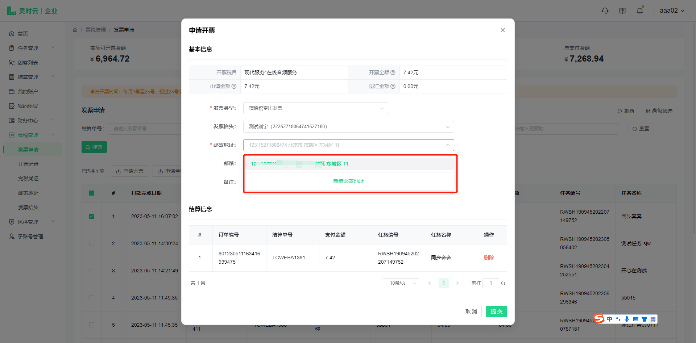

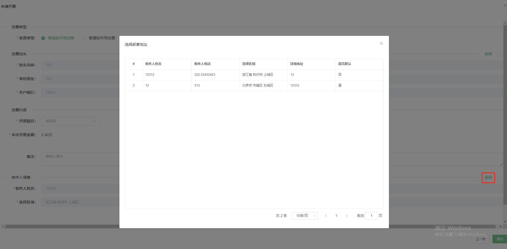

点击【提交】按钮，开票申请提交成功，等待审核，可在开票记录中查看到对应的开票申请详细信息。

## 2. 开票记录

点击侧边导航栏-票税管理-开票记录，当前页面显示已提交的所有开票申请，输入申请编号、税源地或者选择审核状态、开票状态、进行开票记录的筛选如下图：

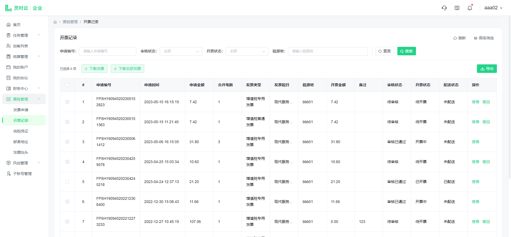

点击【查看】按钮，可查看详细信息，如下图所示：

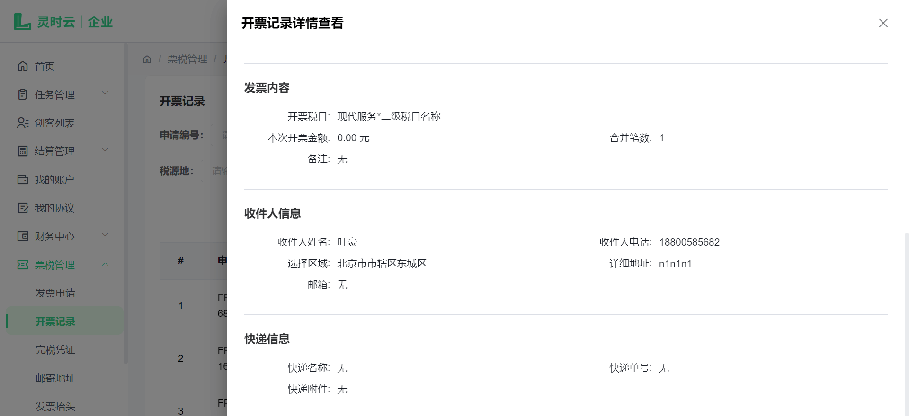

点击【撤回】二次确认，撤回发票后可重新申请开票。（注意当前开票信息为待审核/待开票状态，若已审核/已开票不可撤销）如下图：

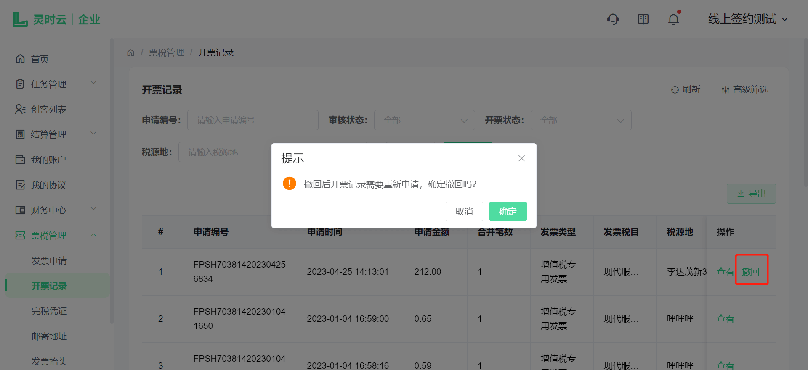

## 3. 发票抬头

点击侧边导航栏-票税管理-发票抬头，当前页面显示用户添加的所有抬头信息，输入抬头名称、电话号码进行查询。如下图：（用户申请开票的时候，系统将自动填充默认的抬头信息）

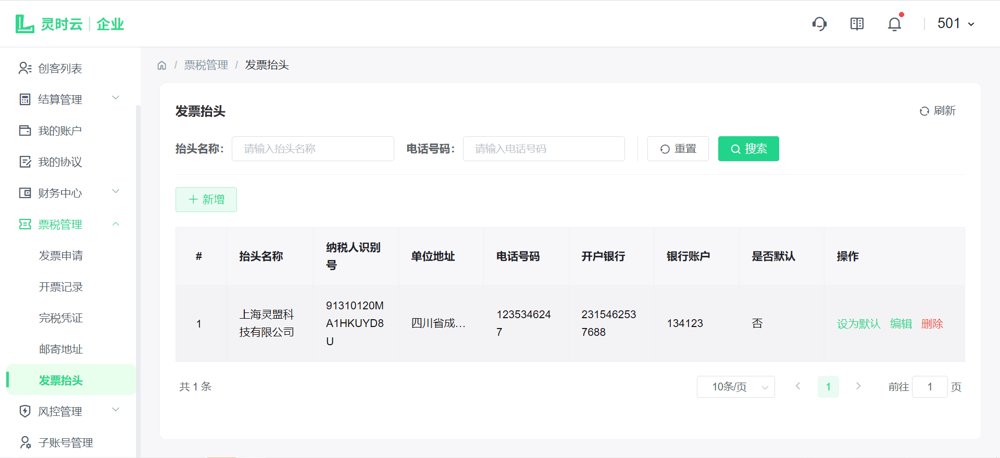

点击【新增】按钮可以新增抬头信息，如下图：

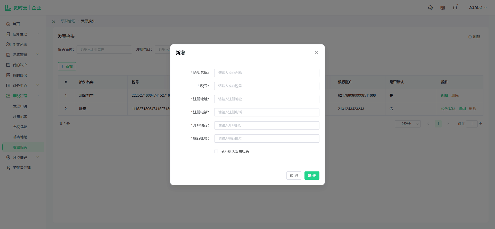

点击【编辑】按钮可以修改抬头信息；

点击【默认】按钮可将当前抬头信息设置为默认；

点击【删除】按钮可以删除当前抬头信息。

## 4. 邮寄地址

点击侧边导航栏-票税管理-邮寄地址，当前页面显示用户添加的所有地址信息，输入收件人姓名、收件人电话来查询收件人。如下图：（用户申请开票的时候，系统将自动填充默认的地址信息）

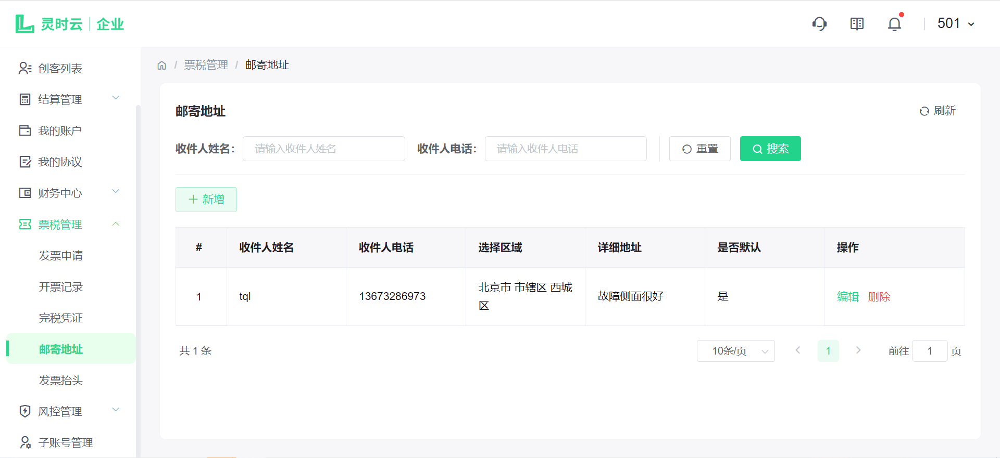

点击【新增】按钮可以新增地址信息，如下图：

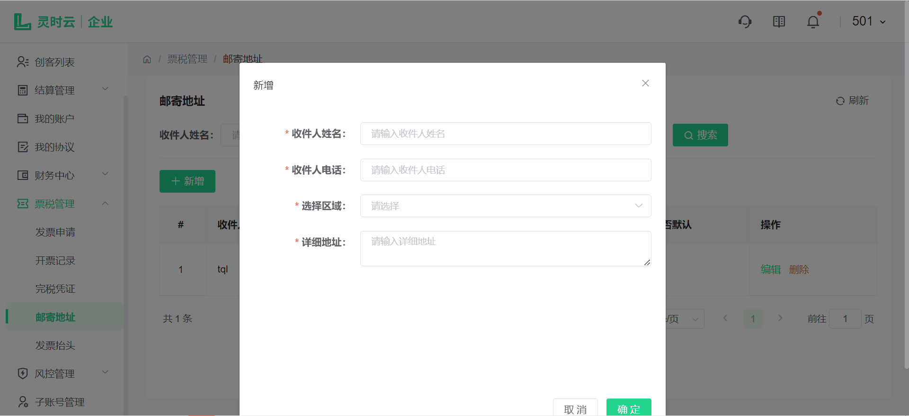

点击【编辑】按钮可以修改地址信息；

点击【默认】按钮可将当前地址信息设置为默认；

点击【删除】按钮可以删除当前地址信息。
