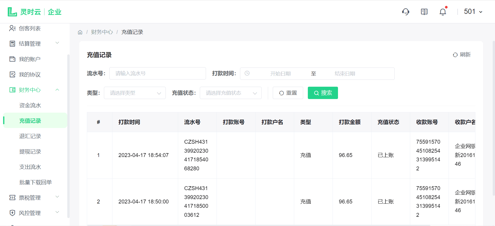
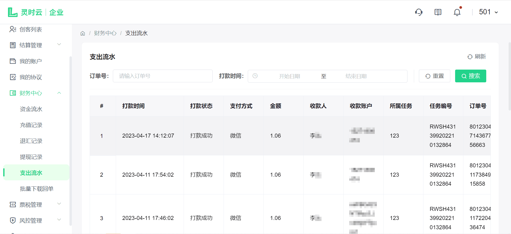

# 财务中心

## 1. 充值记录

点击侧边导航栏-财务管理-充值记录，查看该商户的充值记录,可以看到充值的打款时间、流水号、打款账号、打款户名、打款金额、充值状态、收款账号、收款户名、备注等详细信息，可根据打款开始时间至打款结束时间、充值状态、流水号等查询充值记录。如下图：

## 2. 支出流水

点击侧边导航栏-财务管理-支出流水，查看该商户的支出记录，选择打款开始时间至结束时间查询账户的支出记录。如下图：

