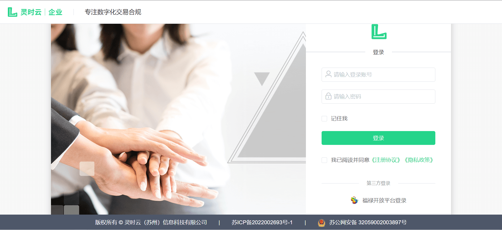
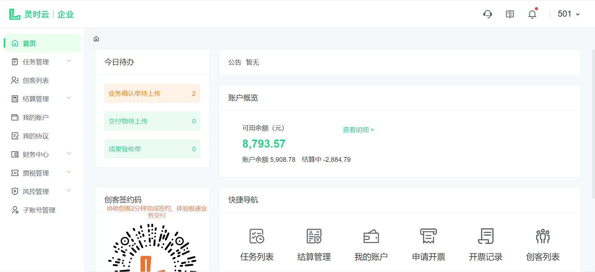

# 登录

打开官网[http://s.linsyun.com](http://s.linsyun.com)根据运营人员创建的商户账号进行登录，输入账号、密码，登录成功之后如下图：

商户端首页，查看该商户的账户余额、可用余额、结算中金额等信息。快捷导航迅速跳转到需要进入的功能页面。消息通知是围绕系统与用户进行沟通交流的重要方式，目的在于让用户了解新事件的信息动态，今日代办会展示今日需办理的业务事项。创客签约码用于提供给用户去认证签约。

