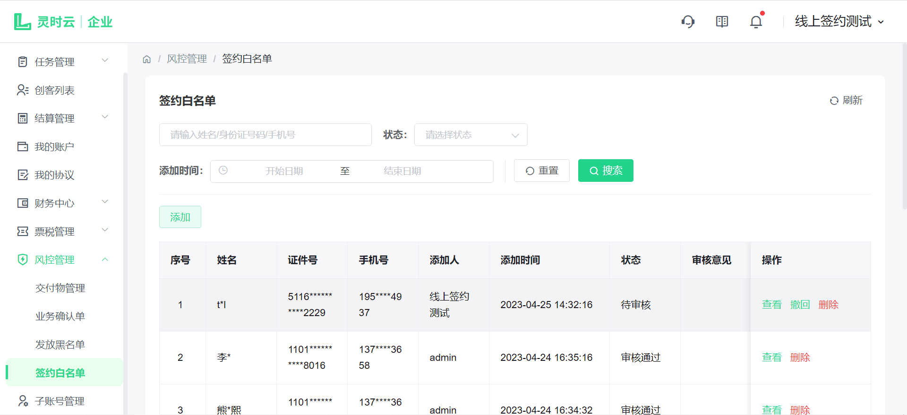
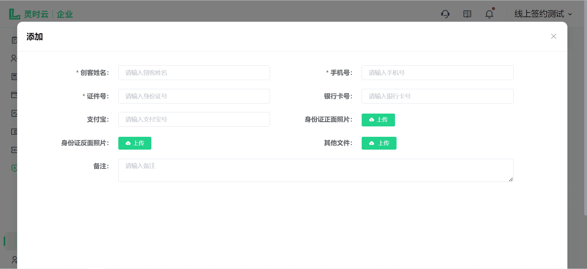
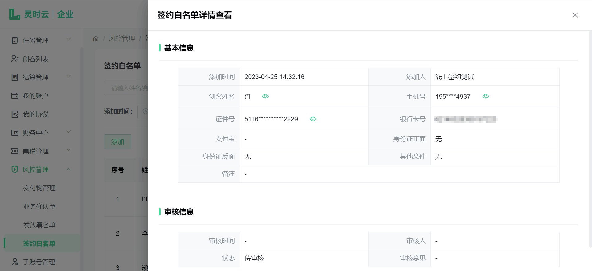
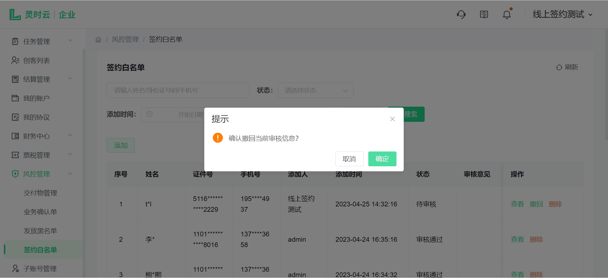
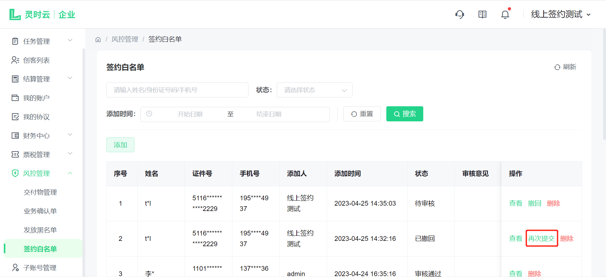
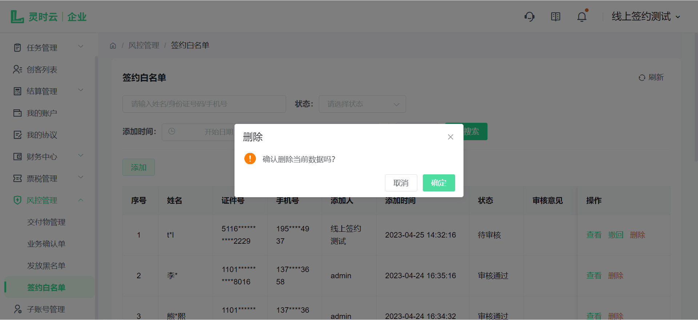
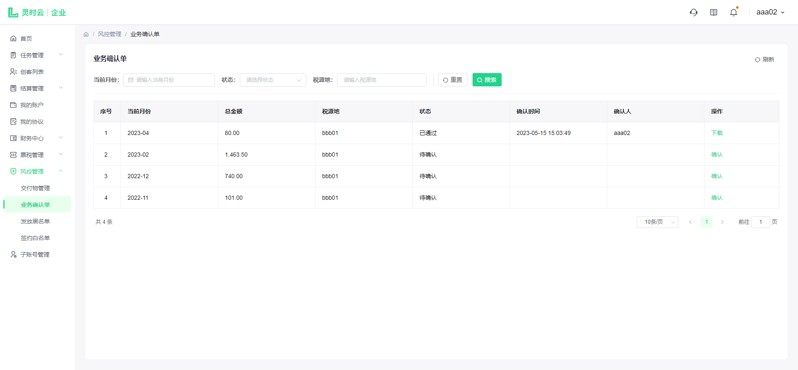
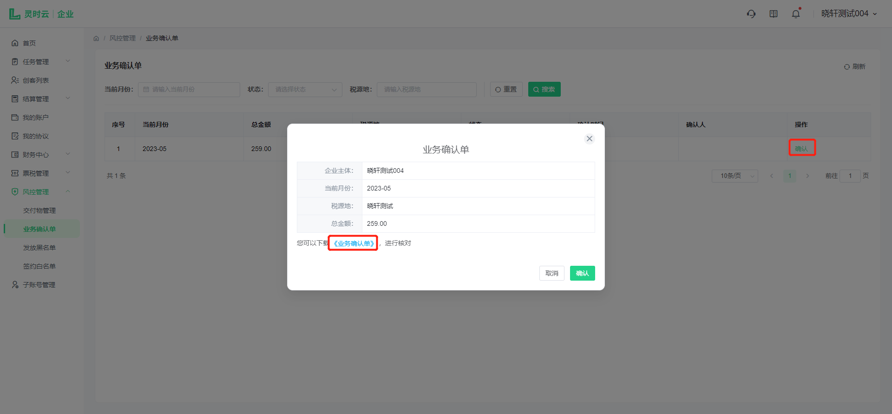
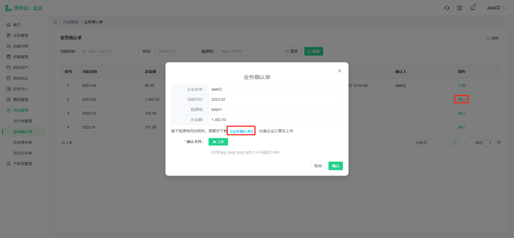
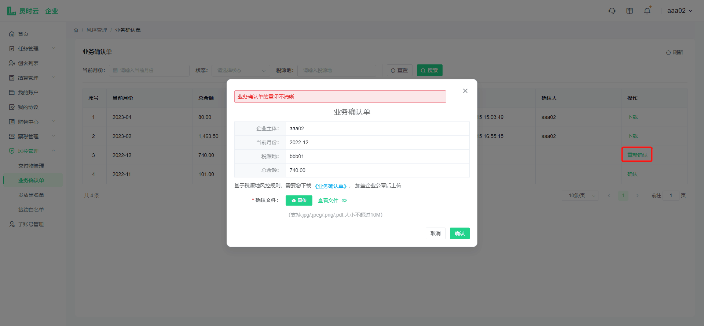

# 风控管理

## 1. 签约白名单

点击侧边导航栏-风控管理-签约白名单，当前页面显示所有白名单人员信息，可以输入姓名/身份证号/手机号，选择状态和添加时间进行筛选如下图：

### 1.1. 添加白名单

点击【添加】填写对应人员的信息，点击【确定】即可添加白名单，如下图：

点击【查看】可查看人员详细信息，如下图：

点击【撤回】二次确认，可撤回当前白名单申请（状态为待审核时可撤回），撤回后可点击【再次提交】编辑信息后重新提交白名单，如下图：

点击【删除】二次确认，可删除有误的白名单信息，如下图：

## 2. 业务确认单

系统每月2号会根据上月打款成功且未退汇的订单，按照商户和税源地汇总，生成待确认的记录；您需在该页面对待确认的业务确认单进行确认。如下图：

### 2.1. 线上确认

您无需上传盖章文件，直接点击【确认】，即可完成业务确认单的确认且无需审核，自动跳转为已通过，并生成已确认的可下载的业务确认单文件。如图所示：

### 2.2. 线下盖章确认
您需下载业务确认单，盖章后上传；等待运营端审核，审核通过后，状态变为已通过；若驳回的话，确认单状态变为已驳回，您可以重新上传。如下图所示：

