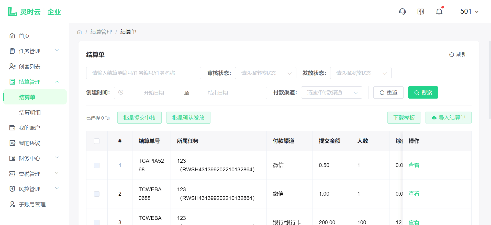
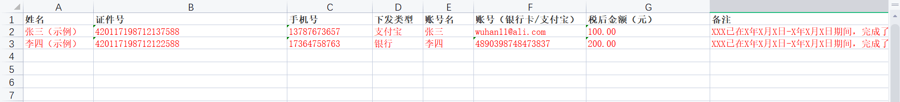
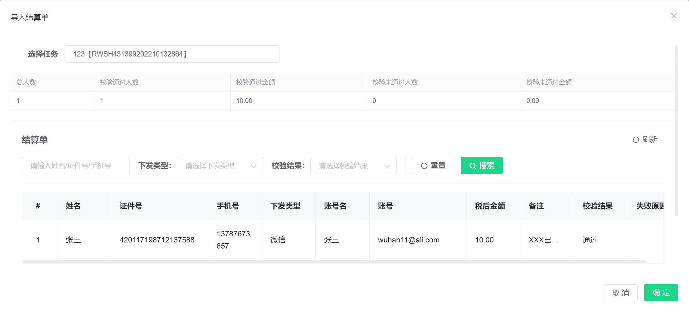
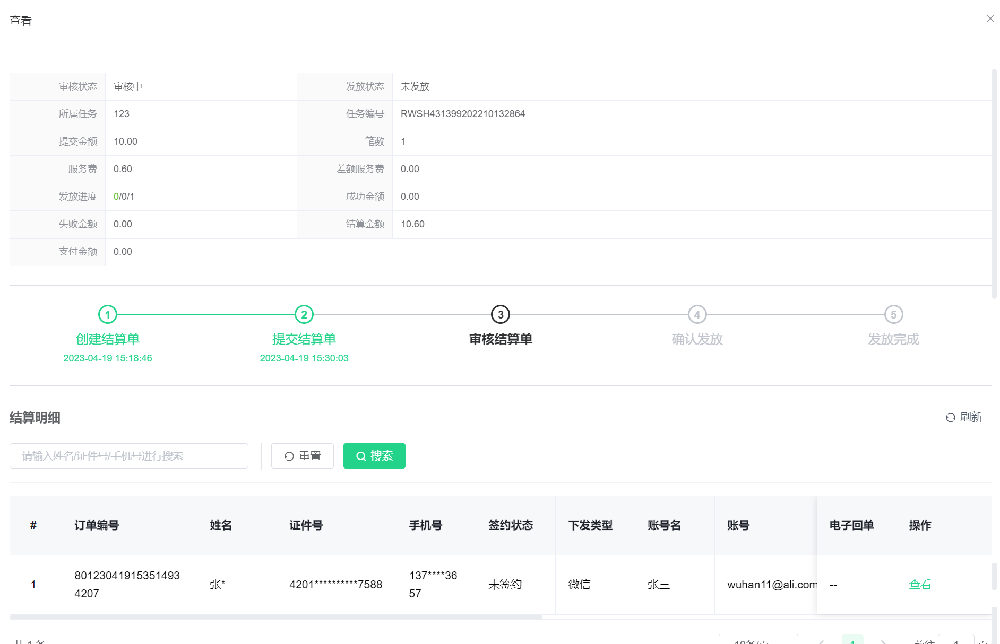
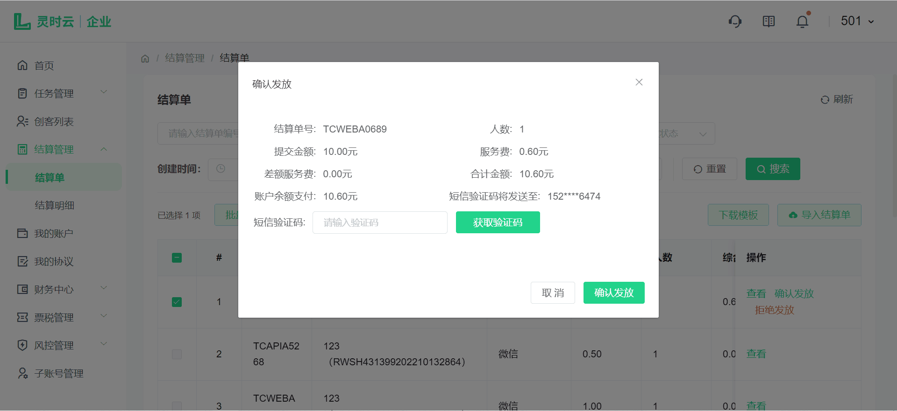
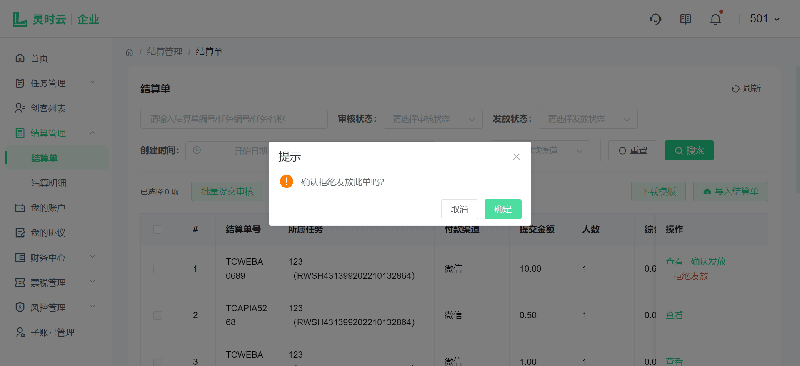
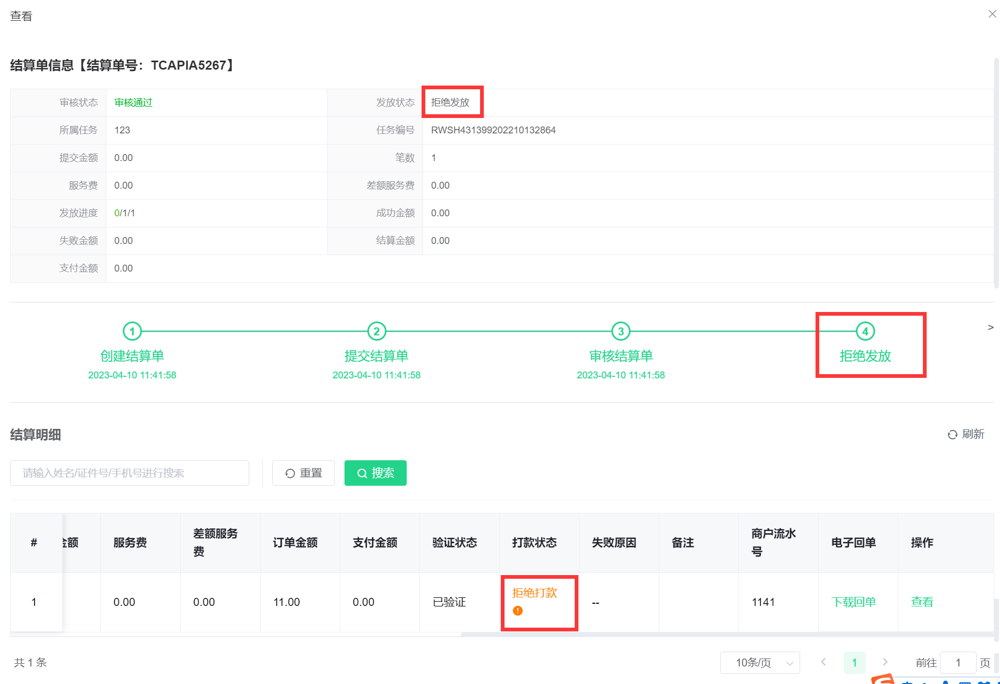
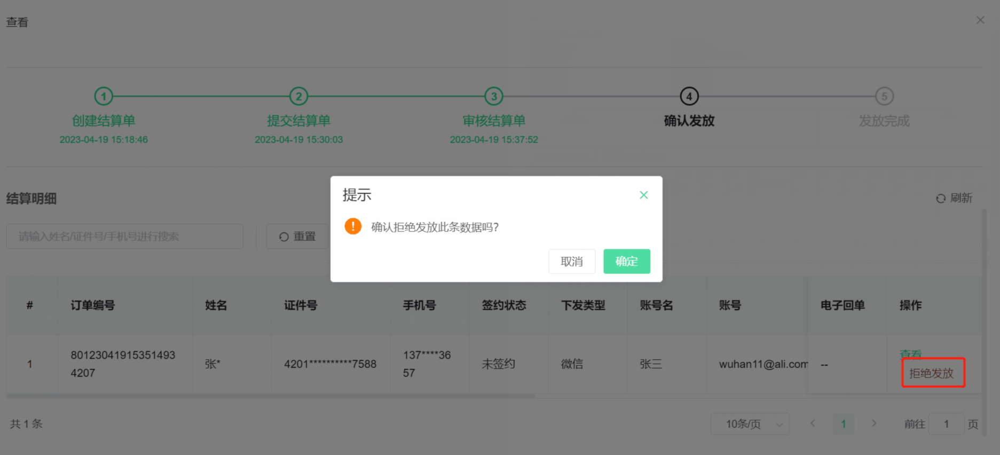
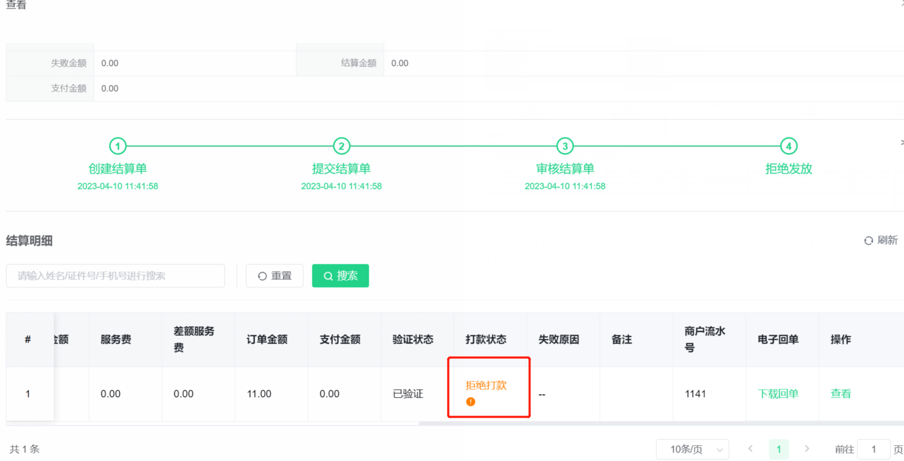
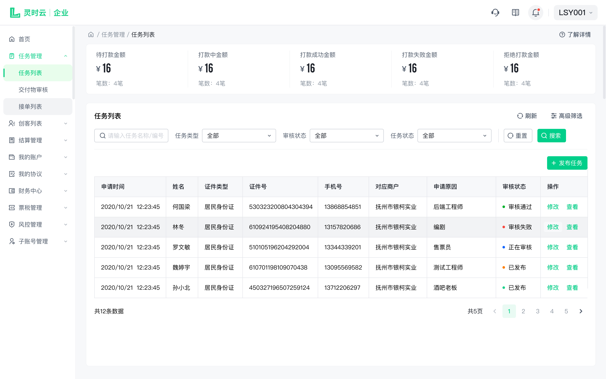

# 结算管理

## 1. 结算单

点击侧边导航栏-结算管理-结算单，查看已上传的所有结算单，可以通过结算单编号/任务编号/任务名称、审核状态、发放状态、创建时间、付款渠道进行结算单查询，如下图：

### 1.1. 结算单导入

您可先点击【下载模板】按钮，下载完后点击文件打开按照模板依次填写好对应信息，如下表：

然后点击【导入结算单】选择您刚刚填写好保存的文件，进入导入结算单页面。可看见导入的结算单列表，您需选择任务后点击【确定】即可成功导入。如下图：（Web API用工上传结算单时，每个结算单系统会自动生成一条任务，任务名称：商户名称创建任务，任务描述：商户名称准备打款，任务金额：计划金额-计划金额*100）

### 1.2. 提交审核

进入结算单列表，可查看到已导入成功的结算单，点击【提交审核】或勾选多个结算单后【批量提交审核】，等待审核通过即可进入发放。如下图所示：

### 1.3. 查看结算单

进入结算单列表，提交审核后可点击【查看】可查看结算单数据、进度及结算明细。如下图所示：

### 1.4. 确认发放

进入结算单列表，针对审核通过的结算单，可以进行确认发放，可点击【确认发放】或勾选多个结算单后【批量确认发放】，确认发放需填写验证码后点击【确认】即可发放成功。如下图：

### 1.5. 拒绝发放

进入结算单列表，针对审核通过的结算单，可以进行整单拒绝发放，点击【拒绝发放】按钮，进行二次确认，点击确认后，整单拒绝发放，结算单状态变为拒绝发放，其下明细数据的发放状态变为拒绝发放，打款状态变为拒绝打款，如下图所示：

也可点击【查看】进入查看详情页面，针对明细列表中的结算单进行部分拒绝发放，点击【拒绝发放】按钮，进行二次确认，点击确认后，可对当前的数据行进行拒绝发放，发放状态变为拒绝发放，打款结果变为拒绝打款，如下图所示：

## 2. 结算明细

点击侧边导航栏-结算管理-结算明细，查看已上传的所有结算单的数据明细，汇总当前搜索状态下，打款结果各状态的汇总金额和汇总笔数，并可将明细数据导出，如下图：

