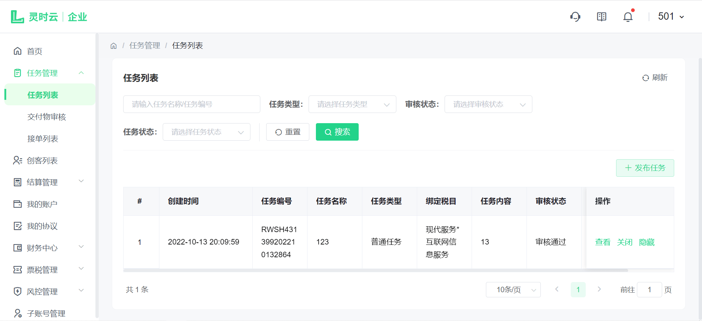
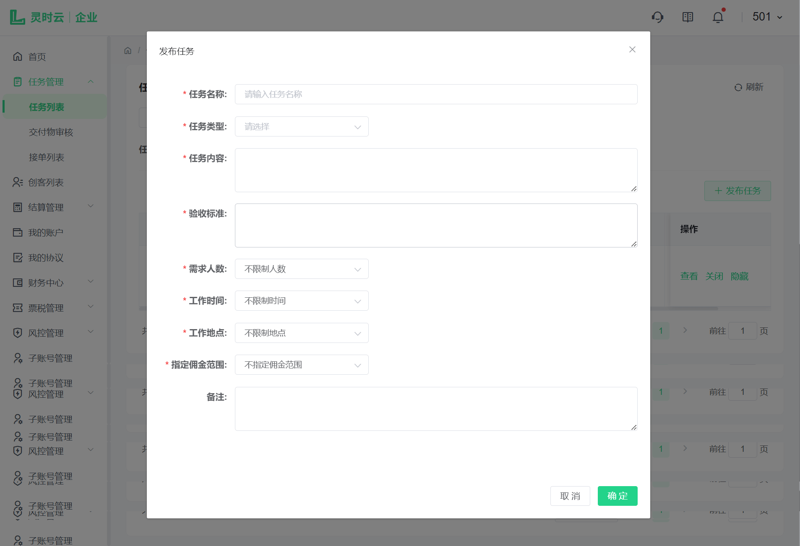
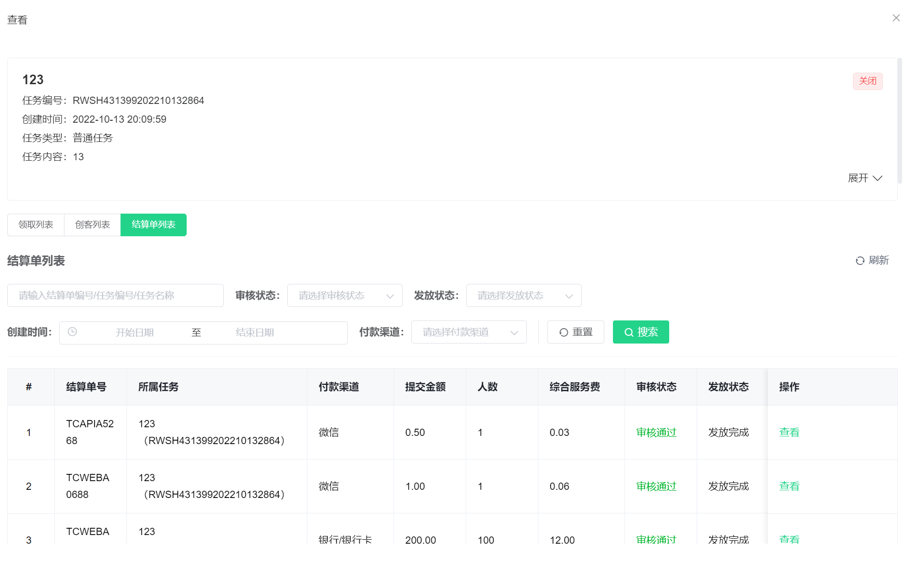
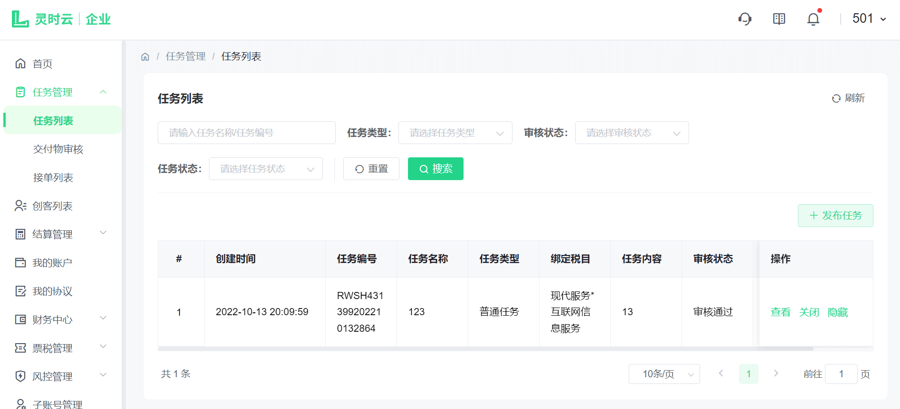

# 任务管理

商户登陆后，点击侧边导航栏-任务管理-任务列表，查看已发布的所有任务，可以根据任务名称/任务编号、任务类型、审核状态、任务状态等条件进行任务筛选如下图：

## 1. 发布任务

点击【发布任务】按钮，填写任务名称、任务类型、任务内容、验收标准、需求人数、工作时间、工作地点、指定佣金范围、备注（选填），点击【确定】按钮后，任务自动生成任务编号，如下图：

## 2. 查看

点击查看按钮，可查看任务的基本信息和任务下的用工计划（依次包含领取列表、创客列表、结算单列表），如下图所示：

## 3. 操作

点击【关闭】按钮，任务变为关闭状态，点击【开启】即可重新开启任务；点击【隐藏】按钮，任务将在用户端隐藏，点击【展示】即可重新展示任务。如下图：

